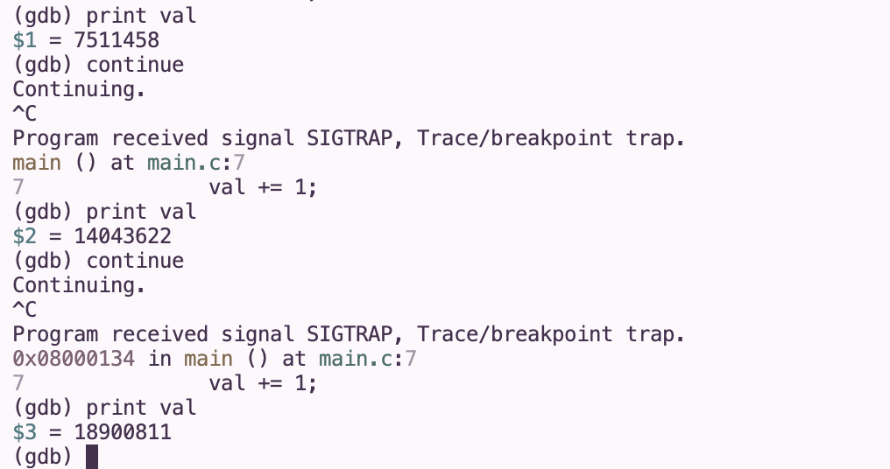

# STM32 Bare Metal OS
A bare metal operating system built from scratch on the STM32F103C8T6 (Blue Pill). Written in ARM assembly and C.

## What This Is
Starting from power-on, the CPU reads the vector table at the start of flash (`0x08000000`), loads the stack pointer, and jumps to the reset handler. The reset handler copies initialized variables from flash to RAM, zeroes the BSS section, then calls `main()`. GPIO and an interrupt-driven SysTick timer are implemented for precise timing. No HAL or abstraction libraries, every register is accessed directly.

## Learning
- Bare metal ARM programming and direct register access
- ARM [Cortex-M3](https://www.st.com/resource/en/reference_manual/rm0008-stm32f101xx-stm32f102xx-stm32f103xx-stm32f105xx-and-stm32f107xx-advanced-armbased-32bit-mcus-stmicroelectronics.pdf#page=49.32) boot sequence and memory map
- Linker scripts, ELF sections, and memory placement
- Interrupt-driven programming with SysTick and NVIC
- GDB debugging over SWD

## Resources
- [Vivonomicon bare metal STM32 series](https://vivonomicon.com/2018/04/20/bare-metal-stm32-programming-part-1-hello-arm/)
- [RM0008 — STM32F103 reference manual](https://www.st.com/resource/en/reference_manual/rm0008-stmicroelectronics.pdf)
- [STM32F103C8 datasheet](https://www.st.com/resource/en/datasheet/stm32f103c8.pdf)
- [csrohit — linker script tutorial](https://medium.com/@csrohit/writing-linker-script-for-stm32-arm-cortex-m3-%EF%B8%8F-fdc2acaaddcc)
- [CMSIS header files](https://github.com/modm-io/cmsis-header-stm32/tree/master)

## Hardware
- STM32F103C8T6 (Blue Pill) - Cortex-M3, 64K flash, 20K RAM
- ST-Link V2 — SWD flashing and debugging
- CP2102 USB-UART — serial output

## Toolchain
- `arm-none-eabi-gcc` / `arm-none-eabi-as` — compiler and assembler
- `arm-none-eabi-gdb` — debugger
- `st-util` — GDB server over ST-Link
- STM32CubeProgrammer — flashing

## Project Structure
```
.
├── device_headers/
│   ├── core_cm3.h          # ARM Cortex-M3 core definitions
│   ├── stm32f103xb.h       # STM32F103 peripheral register definitions
│   ├── stm32f1xx.h         # STM32F1 family definitions
│   ├── system_stm32f1xx.h  # system configuration
│   ├── cmsis_compiler.h    # compiler abstraction
│   ├── cmsis_gcc.h         # GCC specific CMSIS definitions
│   └── cmsis_version.h     # CMSIS version information
├── media/                  # demo GIFs and screenshots
├── core.S                  # reset handler — copies .data, zeroes .bss, calls main
├── vtable.S                # vector table — interrupt handlers, weak aliases to default
├── interrupts.c            # SysTick handler and interrupt service routines
├── interrupts.h            # interrupt declarations and tick counter
├── linker.ld               # memory map — FLASH/SRAM regions, section placement
├── main.c                  # application entry point
├── main.h                  # pin definitions and includes
└── Makefile                # build system
```

## Build
```bash
make
make clean
```

## Debug
```bash
# Terminal 1
st-util

# Terminal 2
arm-none-eabi-gdb main.elf
(gdb) target remote :4242
(gdb) monitor reset halt
(gdb) load
(gdb) continue
```

## Progress & Demo
### Part 1 — Vector table, reset handler, linker script
Boot sequence verified via GDB: `val` incrementing in real time, read directly from RAM over SWD:


### Part 2 — GPIO
Bare metal GPIO: Onboard LED blinking at ~1Hz via direct GPIO register access, no HAL


### Part 3 — SysTick Timer
Replaced NOP delay loop with interrupt-driven SysTick timer for precise 1ms ticks. Demonstrated with SOS morse code blink pattern:


### Part 4 — UART
Polling-based UART TX and RX via USART1. PA9 (TX) configured as alternate function push-pull, PA10 (RX) as input with pull-up. Verified with CP2102 USB-UART adapter. Alphabet streaming over TX and bidirectional echo server over RX:
